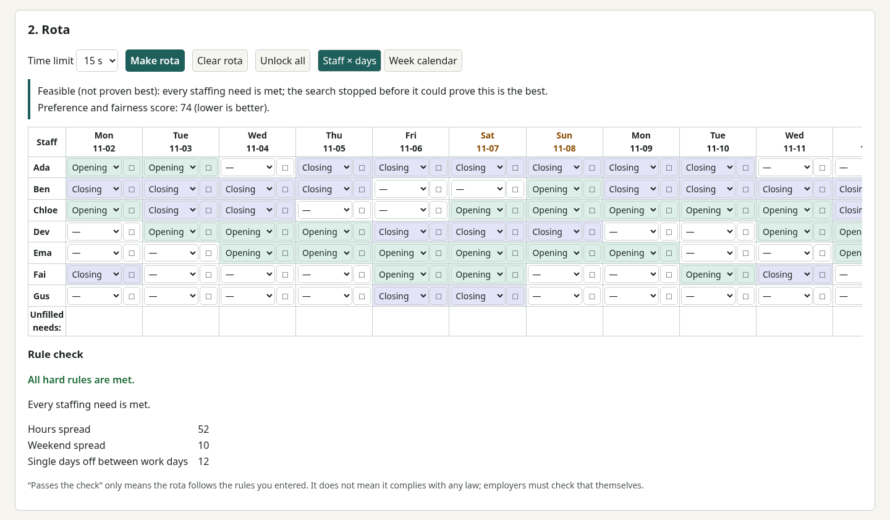

# ShiftKnit · 排更易

**English** · [繁體中文](#繁體中文)



ShiftKnit is a free, open-source, offline staff rota builder for small shops,
restaurants, clinics, care homes, NGOs and volunteer teams. It builds a rota
automatically from your rules (availability, leave, minimum rest between shifts,
weekly hours, maximum consecutive days, rest days, staffing and skill needs,
manual locks), and **every rota is checked rule by rule by an independent
checker** before it is shown. It says honestly whether a rota is _proven
optimal_, _feasible but not proven optimal_, or _impossible_ (with the smallest
conflict it found).

- No account, no server, no telemetry, no per-user fees. Your data stays in your
  browser.
- English and Traditional Chinese.
- Licence: [AGPL-3.0-or-later](LICENSE).

### Use it

- **In the browser:** <https://kinfxhk.github.io/shiftknit/> — nothing to install,
  and it works offline after the first visit. Your data stays in your browser.
- **Download:** a static site zip (with SHA-256) is attached to each
  [release](https://github.com/Kinfxhk/shiftknit/releases).
- **On your own computer** (Node.js 22+):

```sh
npm ci
npm start   # http://127.0.0.1:4883/
```

- **Docker** (serves only the static site, on your own machine):

```sh
docker build -t shiftknit .
docker run --rm -p 127.0.0.1:4883:4883 shiftknit
```

- **Guide:** [docs/guide.md](docs/guide.md) · rules, result labels, "why this rota",
  exports, command line. Hong Kong rest-day preset: [docs/hk-rest-day.md](docs/hk-rest-day.md).
- **Examples:** [examples/](examples/) (small café, care home with night shifts,
  volunteer team across a clock change).
- How the solver and checker work: [docs/solver.md](docs/solver.md).

### Important

- **Not legal advice.** "Passes all checks" only means the rota follows the rules
  _you_ entered. It does not mean it complies with any law or contract. The Hong
  Kong rest-day preset quotes a public Labour Department guide for convenience;
  it is not legal advice. Employers must check their own obligations.
- ShiftKnit is an independent project and is **not affiliated** with, endorsed by
  or sponsored by any other scheduling product or company.

Source code: <https://github.com/Kinfxhk/shiftknit>

If ShiftKnit helps you, you can support it at
[Buy Me a Coffee](https://buymeacoffee.com/kinfxhk).

---

## 繁體中文

排更易（ShiftKnit）是免費、開源、可離線使用的員工排更工具，適合小店、餐廳、診所、
安老院舍、非政府機構及義工隊。它按你設定的規則（可工作時段、請假、兩更之間的休息
時數、每週工時、最多連續工作日、休息日、人手及技能需求、手動鎖定）自動排更，而且
**每份更表在顯示前都經獨立檢查器逐條驗證**。結果會如實標明「已證明最佳」、「可行
（未證明最佳）」或「無解」（並列出找到的最細衝突）。

- 無需帳戶、無伺服器、無遙測、不按人頭收費；資料只存於你的瀏覽器。
- 提供英文及繁體中文介面。
- 授權：[AGPL-3.0-or-later](LICENSE)。

### 使用方法

- **瀏覽器：**<https://kinfxhk.github.io/shiftknit/>，無需安裝，首次瀏覽後可離線使用，資料只存於你的瀏覽器。
- **下載：**每個 [release](https://github.com/Kinfxhk/shiftknit/releases) 都附有靜態網站 zip 及 SHA-256。
- **在自己電腦執行**（Node.js 22 或以上）：見上方英文部分的指令（`npm ci`、`npm start`）。
- **使用說明：**[docs/guide.zh-Hant.md](docs/guide.zh-Hant.md)；香港休息日預設：
  [docs/hk-rest-day.md](docs/hk-rest-day.md)。
- **範例：**[examples/](examples/)（小型咖啡店、設夜更的安老院、義工隊）。

### 重要事項

- **非法律意見。**「通過檢查」只代表更表符合**你自己**輸入的規則，並不代表符合任何
  法例或合約。香港休息日預設只是為方便而引用勞工處公開指南，並非法律意見；僱主須自行
  確認本身的責任。
- 排更易是獨立項目，與任何其他排班產品或公司**並無關連**，亦未獲其認可或贊助。

原始碼：<https://github.com/Kinfxhk/shiftknit>

如果排更易對你有幫助，歡迎到 [Buy Me a Coffee](https://buymeacoffee.com/kinfxhk) 支持。
